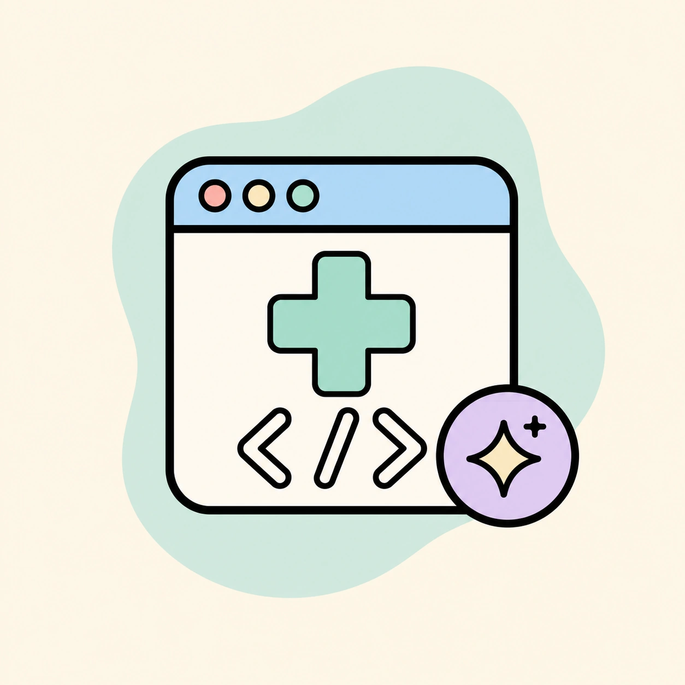

<p align="center">
  
</p>

# 🏥 Crea Aplicaciones Personalizadas (Sin saber programar)

¡Hola! 👋 Si eres **médico, enfermero/a o profesional sanitario**, este es tu lugar.

Necesitas crear una herramienta personalizada (calculadora clínica, generador de turnos, gestor de pacientes) pero **no sabes programar**. ¡Perfecto! Aquí usamos **Inteligencia Artificial** para que **tú dictes qué hacer** y la IA escriba el código por ti.

**No necesitas entender GitHub, código, HTML, CSS o JavaScript. Solo necesitas explicar claramente qué quieres que haga tu aplicación.**

---

## 🚀 Cómo crear tu aplicación (5 pasos fáciles)

### **Opción Recomendada: Usa un Asistente de IA** (La forma más fácil)

Si no sabes qué es GitHub o prefieres que todo sea automático, esta es tu opción.

**Necesitas:**
- Un ordenador o móvil
- Una aplicación de IA (Antigravity, Claude Code, ChatGPT, Copilot, Cursor)

**Los pasos:**

1. 📲 **Abre tu asistente de IA** (Antigravity es lo recomendado)
   - Dirígete al chat de tu IA favorita

2. ⬇️ **Descarga este proyecto a tu ordenador**
   - Haz clic en el botón verde **"Code"** arriba a la derecha
   - Selecciona **"Download ZIP"**
   - Descomprime la carpeta en tu escritorio

3. 📂 **Abre la carpeta con tu IA**
   - En tu asistente de IA, abre esta carpeta (muchas IAs tienen botones para esto)
   - La IA cargará automáticamente las instrucciones

4. ✨ **Escribe el comando mágico**
   - En el chat, escribe:
   ```
   /create-vanilla-app-v2
   ```
   - *(Opcional: puedes usar el comando original `/create-vanilla-app` si prefieres algo más simple).*
   - Presiona Enter y **la IA te guiará paso a paso**.
   - **V2 es la versión recomendada**: Es más profesional, crea carpetas organizadas, permite guardar datos (persistencia) y tiene un proceso de diseño mucho más detallado.
   - Solo tienes que describir tu idea en lenguaje normal y la IA se encargará de todo.

5. 🎉 **¡Hecho!**
   - Busca el archivo `index.html` en la carpeta que creó la IA
   - Haz doble clic y ¡tu app se abre en el navegador!
   - Comparte el enlace de Netlify Drop (la IA te dirá cómo) 🌐

---

### **Opción Avanzada: Si eres técnico o quieres aprender Git**

Si ya conoces GitHub o quieres que las versiones de tu app queden guardadas automáticamente:

1. **Clona este repositorio** en tu ordenador
2. **Abre la carpeta en tu IA** (Antigravity, Claude Code, etc.)
3. **Ejecuta `/create-vanilla-app-v2`** (recomendado para apps más robustas)
4. **La IA guardará automáticamente los cambios** en GitHub

---

## 🧠 Opción para usuarios más técnicos: Codex

Si ya usas **Codex** o te sientes cómodo trabajando con un agente de programación, este repositorio también incluye un skill más avanzado:

```txt
$ai-app-builder
```

Esta opción está pensada para aplicaciones más complejas que una app que se abre con doble clic. Por ejemplo:

- Apps con usuarios y login
- Bases de datos
- Permisos por tipo de usuario
- Paneles internos
- Formularios que guardan información
- Archivos privados
- Despliegue profesional en internet

Para la mayoría de personas sin experiencia técnica, la mejor opción sigue siendo **Antigravity + `/create-vanilla-app-v2`**.

Usa `$ai-app-builder` solo si quieres que Codex planifique y construya una app más grande, con más piezas técnicas.

### Cómo trabaja

Antes de escribir código, Codex te hará preguntas, resumirá lo que entiende, propondrá un plan y te pedirá confirmación. Solo empezará a construir cuando apruebes el plan.

### Diferencia rápida

- `/create-vanilla-app-v2` crea apps simples en HTML/CSS/JS que funcionan abriendo `index.html`.
- `$ai-app-builder` ayuda a Codex a crear apps más completas, con servidor, login, base de datos y despliegue.

Si estás creando una calculadora, una herramienta local o un prototipo rápido, usa `/create-vanilla-app-v2`.
Si necesitas usuarios, datos persistentes, roles o un producto más mantenible, usa `$ai-app-builder`.

### Dónde vive esta opción

El skill de Codex está en:

```txt
.agents/skills/ai-app-builder/
```

No necesitas tocar esa carpeta para usarlo. Está ahí para que Codex tenga instrucciones claras sobre cómo ayudarte a crear una app más avanzada.

---

## 🌐 Cómo compartir tu aplicación (Paso extra)

Cuando tu app esté lista y funcionando, puedes **compartirla con compañeros por internet**. Es muy fácil:

1. 🌐 Abre **[Netlify Drop](https://app.netlify.com/drop)** en tu navegador (no necesitas cuenta)
2. 📂 **Arrastra la carpeta de tu app** (la que creó la IA con `index.html`, `style.css`, `app.js`) al área que dice "Drop"
3. ⏳ Espera unos segundos...
4. 🎉 **¡Listo!** Te aparecerá un enlace único. Ese es tu app compartible:
   - Cópialo y envíalo por **WhatsApp**, **email**, **Teams**, etc.
   - Cualquiera puede usarla desde cualquier dispositivo
   - **No caducará**: estará disponible mientras Netlify esté en línea

---

## 📚 Ejemplos y Referencias

### Ver una aplicación funcionando
Aquí tienes un ejemplo real de lo que puedes crear con esto:

- **App de ejemplo**: Generador automático de turnos para esterilización
  - 📂 Carpeta: `example_rueda_enfermeria/`
  - 🖥️ Demo en vivo: [rueda-enfermeria.netlify.app](https://rueda-enfermeria.netlify.app/)
  - Para probarla: Entra en esa carpeta y haz **doble clic** en `index.html`

### El "cerebro" de la IA
- 📁 **`.agent/workflows/`**: Aquí están las instrucciones que le dicen a la IA cómo construir apps.
  - `/create-vanilla-app-v2`: **Nuestra recomendación.** Más interactivo, profesional y con funciones avanzadas (guardado de datos, validación robusta).
  - `/create-vanilla-app`: La versión original, ideal para prototipos ultra-rápidos y simples.
- 📁 **`.agents/skills/ai-app-builder/`**: Skill avanzado para Codex, pensado para apps más complejas con login, datos guardados y despliegue profesional.

---

## ❓ Preguntas Frecuentes

**P: ¿Necesito saber programar?**
R: No. Solo explica en lenguaje normal qué quieres que haga tu app.

**P: ¿Qué IA necesito?**
R: Recomendamos **Antigravity** (es la más fácil), pero también funcionan Claude Code, Codex, Copilot, Cursor.

**P: ¿Cómo comparto mi app?**
R: Arrastra la carpeta a [Netlify Drop](https://app.netlify.com/drop) y obtendrás un enlace.

**P: ¿Qué es GitHub?**
R: Por ahora, no lo necesitas. Es solo el lugar donde está guardado este proyecto. Puedes ignorarlo.

---

**Tu único trabajo: ser experto en medicina/enfermería. La IA se encarga del resto.** 🚀
